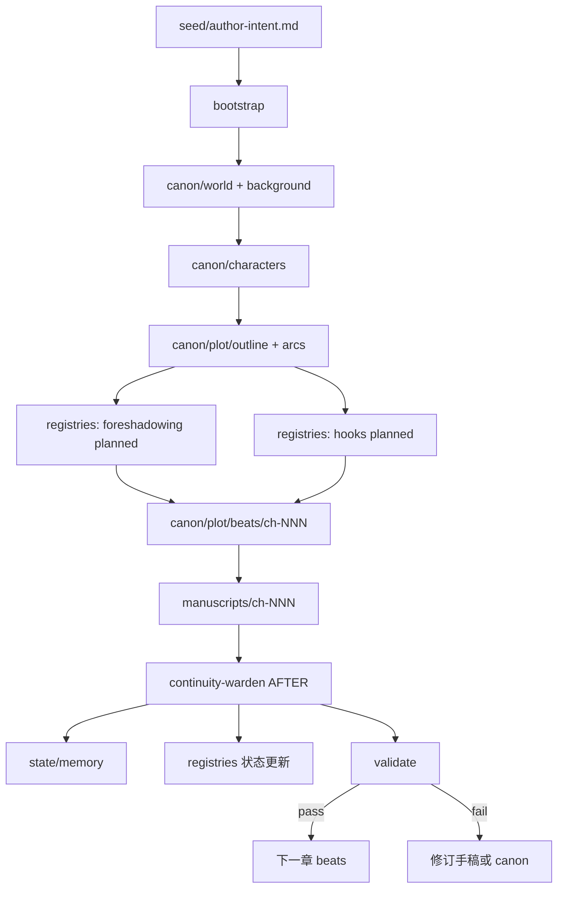

# 生产流水线（链式推导附图）

> **状态迁移与 CLI 绑定以** [`pipeline-state-machine.md`](pipeline-state-machine.md) **为唯一真相源**。本文仅描述 seed→发布的推导链，不重复阶段表。

用户输入 **想象力（seed）** → 框架产出 **可连载手稿**，全程由 Harness 驱动状态迁移。

## 全书状态机

```
ideation → worldbuilding → outlining → drafting ⇄ revision → publish
                              ↑            │
                              └─ 重大改纲 ─┘
```

`state/phase.yaml` 为权威；阶段切换须更新并写 `continuity-log`。

## 链式推导：从设定到发布



## 阶段与 Skill 映射

| 阶段 | 产出目录 | 主 Skill |
|------|----------|----------|
| bootstrap | novel.yaml, seed→premise | seed-intake, novel-bootstrap |
| worldbuilding | canon/world, background | world-architect |
| characters | canon/characters | character-forge |
| outlining | plot/, registries planned | plot-architect, foreshadow-engineer |
| drafting | manuscripts/, state/memory | chapter-production |
| post-chapter | canon delta, registries | continuity-warden |
| revision | manuscripts 修订 | chief-editor, style-guardian |
| publish | publish/exports | ⬜ 待定义（导出脚本或 Skill） |

## 闭环检查点（Definition of Done）

| 检查点 | 条件 |
|--------|------|
| 世界观完成 | `canon/world/rules.md` 存在且无 TBD 硬规则 |
| 大纲完成 | 每计划章有 `beats/ch-{nnn}.md` 或明确「卷纲」 |
| 章完成 | summary 存在 + validate 通过 + hooks 本章项已处理或延期登记 |
| 卷完成 | 本卷伏笔 resolved 率 ≥ 阈值（可配置）或标记下一卷 |

## 用户最小输入

`seed/author-intent.md` 模板字段：

- 核心幻想（一句话）
- 体裁与对标
- 主角欲望/恐惧
- 必含元素 / 禁忌
- 篇幅预期

其余由框架追问并写入 canon，**不强迫用户填表**。
