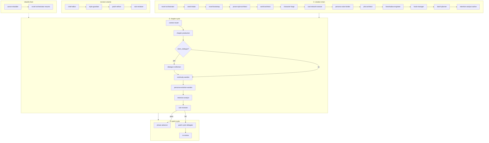

# 统一流水线（Skill 编排 · 禁止孤岛）

各 Skill **不共享对话上下文**，只读写 `stories/{id}/` 协议文件。  
调度：**`pnpm forge next` / `forge run`**（`harness/workflows/`）→ **`forge handoff complete`**。

**状态机**：[`pipeline-state-machine.md`](pipeline-state-machine.md)  
**五层联动**（改 Skill/workflow/文档必读）：[`../harness/layer-sync-contract.md`](../harness/layer-sync-contract.md)

## 总览图

## 单章微流水线（与 chapter-cycle 对齐）

| 步 | workflow id | Skill | handoff postflight 要点 |
|----|-------------|-------|-------------------------|
| 1 | route-context | context-router | manifest + context |
| 2 | draft | chapter-production | 手稿存在 |
| 3 | dialogue | dialogue-craftsman | 条件步 |
| 4 | continuity | continuity-warden | compact --chapter N + validate |
| 5 | persona-evolution | persona-evolution-warden | auto-skip 若无 trigger_chapter |
| 6 | retention | retention-analyst | retention yaml + cool-points delivered |
| 7 | review | rule-reviewer | **review --chapter N** |
| 8 | advance | novel-orchestrator | requires_review_pass |

**禁止**：跳过 handoff 链直接 `phase advance`（CLI 已拦截）。

## 角色隔离原则

1. 主笔不读评审全文；补丁链只读 `action_items[]`
2. rule-reviewer 不调用 LLM；review 由 handoff postflight 强制执行
3. patch-refiner 产出 diff 三元组
4. canon-rebuilder 禁止改 `manuscripts/`
5. orchestrator 不生成正文

## RAG 上下文策略

| 模式 | 何时 | 加载 |
|------|------|------|
| auto | 默认 | manifest JIT（含 `prose-profile` / voice / exemplars） |
| graph_hybrid | 多角色章 | graph 子图 + 角色卡 |
| bm25_fallback | 图谱不足 | keyword-index |

配置：`state/context-mode.yaml`（context-router）

## 工程韧性

| 问题 | 对策 |
|------|------|
| 上下文压缩 | `state/snapshots/` 检查点 |
| 超时 | batch-planner ≤2 章/beats |
| 中断续写 | `last_completed_chapter` + handoff 状态 |
| 层漂移 | [`layer-sync-contract.md`](../harness/layer-sync-contract.md) + `forge workflow validate` |
