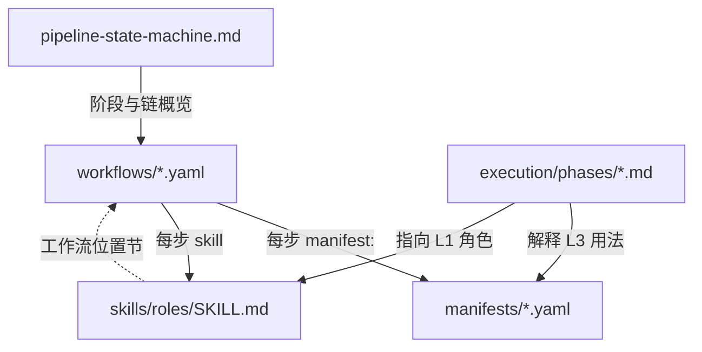

# 五层联动契约（Skill ↔ 编排 ↔ 文档）

> **核心概念**：Skill、workflow、manifest、执行阶段文档、架构状态机**抽象解耦**，但**环环相扣**。  
> 更新任意一层时，必须对照本契约检查其余层是否漂移。  
> 正式测试与后续迭代**必读**。

## 五层职责（不可混写）

| 层 | 管什么 | 真相源路径 | 不管什么 |
|----|--------|------------|----------|
| **L1 Skill** | 角色语义、产出说明、会话内行为 | `skills/roles/*/SKILL.md` | 不定义全局顺序（交给 workflow） |
| **L2 Workflow** | 多智能体顺序、handoff、CLI 门禁、条件步 | `harness/workflows/*.yaml` | 不重复列完整读文件清单（交给 manifest） |
| **L3 Manifest** | BEFORE/DURING/AFTER 文件路径、validators | `harness/manifests/*.yaml` | 不定义步骤先后（交给 workflow） |
| **L4 执行文档** | 人类读序、阶段细则、禁止项 | `docs/harness/execution/phases/*.md` | 不替代可执行脚本 |
| **L5 架构** | 全书阶段迁移、章微生命周期 | `docs/architecture/pipeline-state-machine.md` | 不列逐步 CLI（L2 更细） |

**编排可执行真相源**：`harness/scripts/orchestrator-lib.mjs`（编译 L2 → `forge next` / `handoff`）

## 依赖方向



- **改 L2 workflow** → 必查 L1 对应 Skill「工作流位置」、L3 `skills:` 列表、L4 相关 phase、L5 链式表
- **改 L1 Skill 职责/产出** → 必查 L2 `requires_files` / `handoff_writes`、L3 `during_write`、L4 阶段描述
- **改 L3 manifest 路径** → 必查 L2 是否仍引用该 manifest；`forge manifest` 输出是否与 L4 一致
- **改 L5 状态机** → 必查 L2 `inferWorkflow` 逻辑、所有 L4 lifecycle/phases

## 机械校验（改完必跑）

```bash
pnpm forge workflow validate    # L2 skill ⊆ L3 manifest.skills
pnpm smoke:all                  # L2 handoff + CLI 闭环
```

人工对照清单见下文「迭代检查表」。

## 迭代检查表（勾选后再声称完成）

### 改了 `harness/workflows/*.yaml`

- [ ] `pnpm forge workflow validate` 通过
- [ ] 涉及 Skill 的 `skills/roles/*/SKILL.md` 已更新「工作流位置」与 handoff
- [ ] `docs/architecture/pipeline-state-machine.md` 链式表一致
- [ ] `docs/architecture/unified-pipeline.md` 总览图（若该链出现在图中）
- [ ] `docs/harness/execution/phases/*.md` 对应阶段
- [ ] `skills/README.md` 链式表
- [ ] `docs/style-guide/agent-routing.md` 路由行

### 改了 `skills/roles/*/SKILL.md`

- [ ] 产出路径 ⊆ 对应 manifest `during_write` / `after_must_update`
- [ ] 工作流位置与 `harness/workflows` 某步 `skill:` 一致
- [ ] `reads_handoff` / 前置门禁与 workflow 一致
- [ ] `skills/README.md` 索引行

### 改了 `harness/manifests/*.yaml`

- [ ] 引用该 manifest 的 workflow 步骤仍存在
- [ ] `skills:` 列表 ⊇ 该 manifest 下所有 workflow 步的 skill
- [ ] `docs/harness/execution/README.md` manifest 表
- [ ] 相关 `phases/*.md` BEFORE 清单

### 改了 `orchestrator-lib.mjs` / `forge.mjs`

- [ ] `harness/workflows/README.md` 条件步说明仍准确
- [ ] smoke 覆盖新行为（或扩 `smoke-*.mjs`）
- [ ] `docs/ops/framework-status.md` 能力矩阵
- [ ] 本文「五层」描述仍成立

### 改了 `docs/architecture/pipeline-state-machine.md`

- [ ] 所有 L2 workflow 在阶段表中有映射或显式「按需」
- [ ] `unified-pipeline.md`、`lifecycle.md` 无矛盾陈述
- [ ] `AGENTS.md` 铁律与 GATE 描述一致

## 当前五工作流 × 主文档索引

| workflow | YAML | 主 manifest | 主 phase 文档 | Skill 索引 |
|----------|------|-------------|---------------|------------|
| creation-chain | `creation-chain.yaml` | bootstrap / worldbuilding / characters / outline-batch | 00–03 | `skills/README.md` 创建链（12 步） |
| chapter-cycle | `chapter-cycle.yaml` | chapter-draft / post-chapter | 05–06 | 连载链（8 步） |
| patch-cycle | `patch-cycle.yaml` | —（读 reviews） | 07 | patch-refiner 等 |
| revision-volume | `revision-volume.yaml` | revision-volume | 07 | 卷精修 |
| rebuild-chain | `rebuild-chain.yaml` | rebuild-canon | 08 | canon-rebuilder |

## 正式测试后迭代

1. 记录漂移：哪一层改了、哪一层未同步
2. 先修 **L2 + 脚本**，再修 L1/L3/L4/L5（避免文档领先代码）
3. 跑机械校验 + 更新 `docs/ops/roadmap.md` 已完成项
4. 禁止只改 Skill 对话约定而不改 workflow（会导致 `forge next` 与口头流程分裂）

## 相关入口

- Handoff 协议：[`skills/guides/handoff-protocol.md`](../../skills/guides/handoff-protocol.md)
- 工作流细则：[`../../harness/workflows/README.md`](../../harness/workflows/README.md)
- 正式首跑：[`../ops/first-run-checklist.md`](../ops/first-run-checklist.md)
