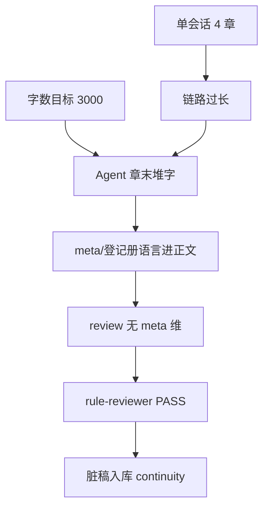

# Harness 生产完整性迭代（2026-06）

> **触发**：《昼隙有渊》ch5+ 正文出现 `chN`、登记册 id、重复章末摘要 — 流程 handoff 齐全但 review 未拦截。  
> **目标**：大模型**不可偷懒** — 门禁由 CLI 强制，不依赖 Agent 自觉。

## 一、根因（反推）



**结论**：不是「Skill 没跑」，是 **门禁不足 + 字数激励错位**。

## 二、迭代包（已执行）

### L2 工作流 / CLI

| 变更 | 文件 |
|------|------|
| production handoff 硬门禁 integrity + 字数 fail | `orchestrator-lib.mjs` |
| `draft check` 含 integrity，fail 则 exit 1 | `forge-lib.mjs`, `forge.mjs` |
| review 维 `meta_prose_leakage` + `anti_padding` | `forge-lib.mjs`, `forge.mjs` |
| continuity postflight scoped validate + 进度日志 | `chapter-cycle.yaml`（前序迭代） |
| manifest CRLF + `during_write_by_skill: []` | `forge-lib.mjs`（前序迭代） |

### L3 阈值

| 键 | 新默认 |
|----|--------|
| `minWordsPerChapter` | 2000 |
| `minWordsHardFail` | 1600 |
| `maxWordsPerChapter` | 4500 |
| `maxChaptersPerSession` | 2 |
| `maxClosingDayEndMarkers` | 1 |
| `maxClosingArcSummaryHits` | 1 |

配置源：`harness/review/config.json` → `state/writing-plan.json` 可覆盖。

### L1 Skill / 指南

- 新增 [`skills/guides/production-integrity-gates.md`](../../skills/guides/production-integrity-gates.md)
- 更新 `chapter-production`、`rule-reviewer`、`session-production-limits`、`golden-rules`、`handoff-protocol`
- 更新 `AGENTS.md` 铁律

### L4 执行文档

- `docs/harness/execution/phases/05-chapter-draft.md`
- `harness/review/rules/README.md`

### L5 架构

- `docs/architecture/pipeline-state-machine.md` — integrity 门禁节点
- `docs/ops/framework-status.md`

## 三、chapter-cycle 强制路径（不可合并）

```
context-router → chapter-production → [dialogue] → continuity → persona → retention → rule-reviewer → advance
                      ↑ draft check + integrity 硬门禁
                                              ↑ review 全维 PASS
```

**禁止**：单会话连写 >2 章、跳过 handoff、自宣布 review PASS。

## 四、机械校验（改完必跑）

```bash
pnpm forge workflow validate
node harness/scripts/smoke-chapter.mjs
pnpm forge draft check stories/{id} --chapter N
pnpm forge review stories/{id} --chapter N
```

**2026-06-11 验证**：上述四条均已 PASS（smoke 含 integrity 门禁 + 全维 review）。

## 五、单书同步

已有书若仍用旧 band：复制 `_template/state/writing-plan.json` 字数段，或 `pnpm forge sync framework`。

《昼隙有渊》已同步 + ch3–8 meta 清理（前序会话）。

## 六、后续（路线图）

- [ ] `patch-refiner` manifest 专章 integrity 修复清单
- [ ] CI 对 smoke-chapter 含 integrity 负例
- [ ] `forge sync framework` 批量升级 writing-plan
