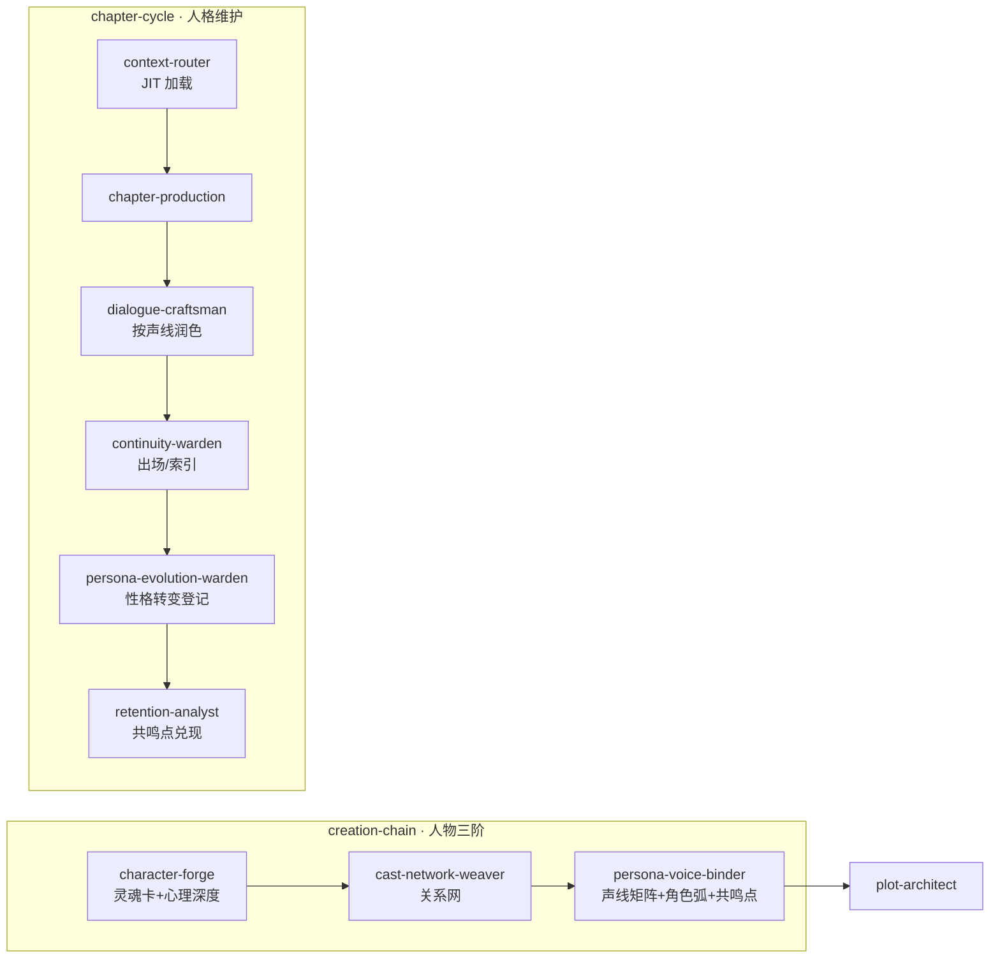

# 人物人格链（Character Persona Chain）

> **性质**：跨 Skill 创作契约 + 连载追踪协议。  
> **与** [`ability-defect-matrix.md`](ability-defect-matrix.md) **并列**：缺陷驱动情节，人格链驱动对白与关系一致性。  
> **新增**：心理深度设计（The Wound → The Lie → Want/Need → Character Arc）

## 链式总览



## 七层分工

| 层 | Skill | 产出 | 职责 |
|----|-------|------|------|
| 灵魂 | character-forge | `canon/characters/{id}.md`、`index.yaml` | 核心角色欲望/恐惧/秘密、外貌锚点、能力缺陷实例、**心理深度字段** |
| 关系 | cast-network-weaver | `cast-roster.yaml`、`entities/graph.yaml`、`appearance-log.yaml` | 父母、师长、同学、社会组织；关系边；出场登记 |
| 声线 | persona-voice-binder | `voice-matrix.yaml`、`registries/persona-shifts.yaml`（planned）、**`registries/character-arcs.yaml`**、**`registries/character-resonance.yaml`** | 说话习惯、OOC 禁忌、性格基线；预埋转变点；**角色弧设计；共鸣点设计** |
| 加载 | context-router | context 快照 | 按章 JIT 拉声线 + 生效中的 persona-shifts + **角色弧阶段** |
| 对白 | dialogue-craftsman | 手稿对话段 | 遵守 voice-matrix；转变后引用 `voice_delta`；**展示 The Lie** |
| 章后 | continuity-warden | `index` last_seen、`appearance-log` | 新角色登记、出场章、关系事实 delta |
| 演化 | persona-evolution-warden | `persona-shifts.yaml` active 项、**`character-arcs.yaml` 状态更新** | 章后确认性格转变是否发生；更新生效章；**确认角色弧阶段转换** |
| 共鸣 | retention-analyst | `character-resonance.yaml` delivered 项 | **章后确认共鸣点兑现；扫描共鸣点遗漏** |

## 心理深度设计

### The Wound → The Lie → Want/Need 链

```
The Wound (核心创伤)
    ↓ 塑造
The Lie (错误信念)
    ↓ 驱动
Want (外在欲望) ← 矛盾 → Need (内在需求)
    ↓ 创造
Core Contradiction (核心矛盾)
    ↓ 产生
Character Arc (角色弧)
```

### 设计原则

1. **Show, Don't Tell**：The Lie 不得直接在正文中讲述，必须通过行为展示
2. **Diagnostic Details**：具体的、非制造的感官细节让角色真实
3. **Iceberg Principle**：知道的比展示的多 10 倍
4. **Maslow's Hierarchy**：用需求层级设计动机冲突

## 文件契约

| 文件 | 写者 | 读者 |
|------|------|------|
| `canon/characters/index.yaml` | character-forge / continuity | 全员 |
| `canon/characters/cast-roster.yaml` | cast-network-weaver | plot、context |
| `canon/characters/voice-matrix.yaml` | persona-voice-binder | dialogue、production、review |
| `canon/entities/graph.yaml` | cast-network-weaver / continuity | context graph_hybrid |
| `registries/appearance-log.yaml` | cast-network-weaver 初始化；continuity 章后追加 | context、review |
| `registries/persona-shifts.yaml` | persona-voice-binder 预埋；persona-evolution-warden 激活 | dialogue、context |
| `registries/character-arcs.yaml` | persona-voice-binder 预埋；persona-evolution-warden 更新 | context、review |
| `registries/character-resonance.yaml` | persona-voice-binder 预埋；retention-analyst 兑现 | context、review |

## 联动铁律

1. **禁止** plot-architect 在 cast-roster 未覆盖父母/核心社会关系时开写大纲
2. **禁止** dialogue-craftsman 忽略 `persona-shifts` 中 `active_from_ch ≤ N` 的 `voice_delta`
3. **禁止** 新人名只出现在手稿而不更新 `index` + `cast-roster` + `appearance-log`
4. 性格转变须**先**在 `persona-shifts` 登记（planned → active），**再**改对白风格
5. review `persona_voice` FAIL → `delegate_skill: dialogue-craftsman`；转变登记遗漏 → `persona-evolution-warden`
6. **新增**：The Lie 须通过行为展示，不得直接讲述；违者 → `delegate_skill: dialogue-craftsman`
7. **新增**：角色弧阶段转换须经 `persona-evolution-warden` 确认；违者 → `delegate_skill: persona-evolution-warden`
8. **新增**：共鸣点兑现须经 `retention-analyst` 确认；违者 → `delegate_skill: retention-analyst`

## 何时不新增 Skill

若仅 1–2 个配角，character-forge 可兼写关系网；**≥5 核心关系节点或含父母线**时，必须走 cast-network-weaver。

## 相关

- [`../roles/character-forge/SKILL.md`](../roles/character-forge/SKILL.md)
- [`../roles/cast-network-weaver/SKILL.md`](../roles/cast-network-weaver/SKILL.md)
- [`../roles/persona-voice-binder/SKILL.md`](../roles/persona-voice-binder/SKILL.md)
- [`../roles/persona-evolution-warden/SKILL.md`](../roles/persona-evolution-warden/SKILL.md)
- [`character-soul-card-schema.md`](character-soul-card-schema.md)
