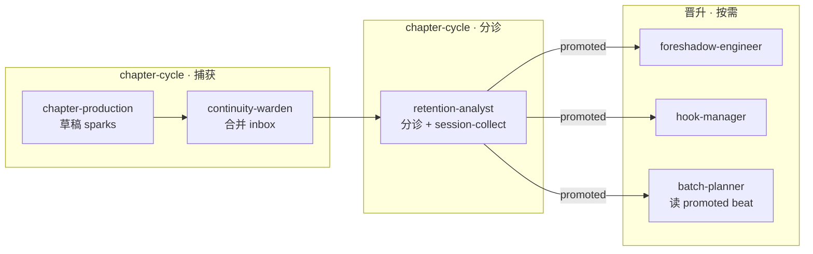

# 叙事火花协议（Narrative Spark Protocol）

> **性质**：跨 Skill 创作契约 — 捕获写章中「灵感乍现」、评估是否反哺长期设计。  
> **与** [`session-relay-protocol.md`](session-relay-protocol.md) **并列**：session-collect 管**待答问题**；叙事火花管**待评估的正面涌现**。

## 问题定义

写正文时模型或作者可能突然想到：

- 小情节、物件、对白、关系微变
- 内含有限但有趣的叙事可能性
- 未必在 beats 里，也可能比 beats 更生动

若只留在手稿或对话里，后续批次规划时极易丢失。**解法**：火花 inbox → 分诊 → 晋升登记册/beats，**而非重写** `outline.md`。

## 大纲策略（铁律）

| 层级 | 文件 | 可否因火花改动 | 规则 |
|------|------|----------------|------|
| 宏观脊柱 | `canon/plot/outline.md` | **极少** | 仅 `plot-architect` + 作者 `author_ack`；禁止章后自动改 |
| 宏观补丁 | `canon/plot/outline-amendments.md` | **可追加** | append-only；记录「因 nk-xxx 调整幕/卷意图」 |
| 故事弧 | `canon/plot/arcs.yaml` | 谨慎 | `impact_tier: arc` 须 author_ack |
| 战术节拍 | `canon/plot/beats/ch-*.md` | **常改** | 晋升 `beat` / `micro` 的主要落点 |
| 登记册 | foreshadow/hooks/open-threads/callbacks | **首选** | 大部分火花晋升到此 |

**原则**：动态丰富故事 ≠ 动态换大纲；用登记册 + beats 增量吸收，宏观 outline 保持稳定。

## 链式总览

## 五层分工

| 步 | Skill | 产出 | 职责 |
|----|-------|------|------|
| 捕获 | chapter-production | `state/working/sparks/ch-{NNN}-draft.yaml` | 写章中记录涌现（≤5 条/章）；**不**擅自改 outline |
| 入库 | continuity-warden | `registries/narrative-sparks.yaml` | 合并 draft → `status: captured` |
| 分诊 | retention-analyst | sparks `triaged` / session-collect | 评 narrative_potential、impact_tier、是否需 author_ack |
| 晋升 | retention-analyst（micro/thread）或作者 ack 后 foreshadow/hook/plot | 目标登记册 / beats / outline-amendments | 写 `linked_registry_id`；原条 `status: promoted` |
| 消费 | batch-planner / context-router | 读 `promoted` + `deferred` 高潜 | 下批 beats 引用；context 加载 open sparks |

## 文件契约

| 文件 | 写者 | 读者 |
|------|------|------|
| `state/working/sparks/ch-{NNN}-draft.yaml` | chapter-production | continuity-warden |
| `registries/narrative-sparks.yaml` | continuity（capture）→ retention（triage/promote） | batch-planner、context、作者 |
| `canon/plot/outline-amendments.md` | plot-architect / retention（outline 级 ack 后） | plot-architect、batch-planner |

## narrative-sparks 字段

见 `stories/_template/registries/narrative-sparks.yaml`。

**impact_tier 分诊启发**：

| tier | 含义 | 典型晋升 | author_ack |
|------|------|----------|------------|
| `micro` | 仅丰富近章质感 | callbacks / beat 注脚 | 否 |
| `thread` | 跨章小承诺 | open-threads | 否 |
| `foreshadow` | 可埋可回收 | foreshadowing planned | 否 |
| `hook` | 读者悬念 | hooks | 否 |
| `beat` | 特定章事件 | beats/ch-*.md | 建议 |
| `arc` | 影响故事弧里程碑 | arcs.yaml | **必须** |
| `outline` | 影响幕/卷结构 | outline-amendments.md | **必须** |

**status**：`captured` → `triaged` → `promoted` | `deferred` | `rejected` | `micro-used`

## 与 session-collect 联动

- `impact_tier` 为 `arc` / `outline` / `beat`（远期章）→ retention 写入 session-collect 追问
- `priority: high` + 未 `author_ack` → 同 session-collect 门禁（不阻断 micro/thread 自动晋升）

## 联动铁律

1. **禁止** chapter-production 因火花直接改 `outline.md` / `arcs.yaml`
2. **禁止** 火花只写 handoff 对话而不落 draft 或 registry
3. **禁止** 未分诊的 captured 火花在下一章 beats 中当作 canon
4. promoted 须写 `linked_registry_id` 或 beats 路径，原 spark 保留审计
5. rejected 须写 `triage_notes` 供后续不重复评估

## 何时不新增 workflow 步

分诊并入 `retention-analyst` 章后步；捕获并入 production + continuity。不增加 chapter-cycle 长度。

## 相关

- [`session-relay-protocol.md`](session-relay-protocol.md)
- [`registry-field-extensions.md`](registry-field-extensions.md)
- [`../roles/chapter-production/SKILL.md`](../roles/chapter-production/SKILL.md)
- [`../roles/retention-analyst/SKILL.md`](../roles/retention-analyst/SKILL.md)
