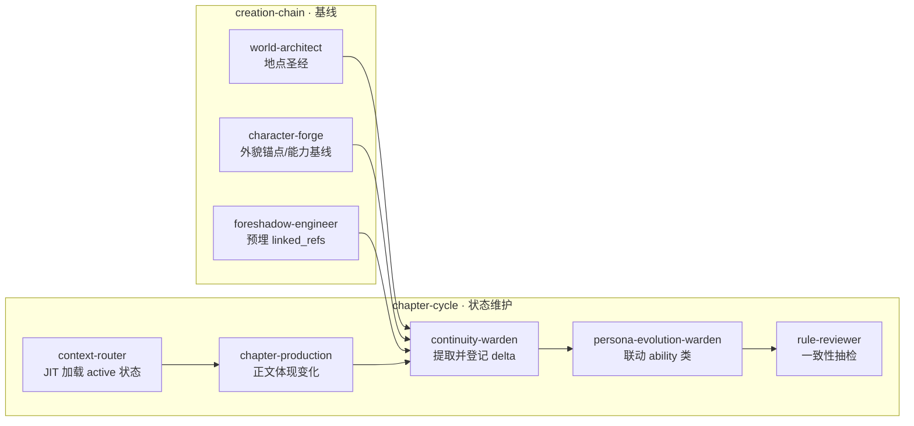

# 状态演化链（State Evolution Chain）

> **性质**：跨 Skill 创作契约 + 连载追踪协议。  
> **与** [`character-persona-chain.md`](character-persona-chain.md) **并列**：人格链管「说话像不像」；状态演化链管「身体/能力/世界有没有变、变了之后能不能忘」。

## 问题定义

长篇连载中，以下变化若只留在 `chapter-summaries` 或对话里，后续章节极易「失忆」：

- 角色伤痕、异象、能力档位、装备得失
- 地点破坏、翻修、封锁、关键物件状态
- 上述变化作为未来钩子/埋点的可检索索引

**解法**：章后提取 → 写入 `character-state-log` / `world-state-log` → 写章前 JIT 加载 active 项。

## 链式总览

## 五层分工

| 层 | Skill | 产出 | 职责 |
|----|-------|------|------|
| 基线 | world-architect | `canon/world/locations/*`、graph 地点节点 | 地点初始状态；可选 world-state-log baseline |
| 基线 | character-forge | 灵魂卡 `appearance_anchor`、能力节 | 角色初始 physique/ability 锚点 |
| 预埋 | foreshadow-engineer / hook-manager | `linked_refs` 指向 fs/hk/cg | 状态变化与未来 payoff 绑定 |
| 加载 | context-router | context 快照含 active 状态 | 写章前拉取本章角色 + 场景相关 world-state |
| 正文 | chapter-production | 手稿 | 变化须在正文可感知；禁止无登记突变 |
| 章后 | continuity-warden | `character-state-log`、`world-state-log` | 从手稿/summary 提取 delta；更新 status |
| 联动 | persona-evolution-warden | 交叉核对 `category: ability` | 性格转变若含能力档变化，同步 csl |
| 评审 | rule-reviewer | continuity 维 WARN | permanent 破坏「无声复原」→ delegate continuity |

## 文件契约

| 文件 | 写者 | 读者 |
|------|------|------|
| `registries/character-state-log.yaml` | continuity-warden；persona-evolution（ability） | context-router、production、review |
| `registries/world-state-log.yaml` | continuity-warden | context-router、production、review |
| `registries/callbacks.yaml` | foreshadow-engineer；continuity | retention、review |
| `state/memory/chapter-summaries/*.yaml` | continuity-warden | compact；**非**唯一真相源 |

## 与现有登记册边界

| 已有 | 管什么 | 状态演化链管什么 |
|------|--------|------------------|
| `persona-shifts.yaml` | 性格/声线转变 | 不管伤痕、能力档位 |
| `power-defects.yaml` | 缺陷类型硬规则 | 不管章级实例化（如「本章鳞纹发烫」） |
| `appearance-log.yaml` | 出场章/场景 | 不管永久痕迹 |
| `foreshadowing.yaml` | 埋设/回收状态机 | 提供 `linked_refs` 反向索引 |
| `callbacks.yaml` | 前后呼应事件 | 可引用 csl/wsl id |

## 章后提取规则（continuity-warden）

1. 读 `character_deltas` / 正文，识别 **新变化**（非重复描述）
2. 每条变化：`id` 递增、`introduced_chapter: N`、`status: active`
3. 同类 `state_key` 已存在 → 更新 `last_updated_ch` 与 `description`；档位升级则旧条 `superseded` + 新条
4. 愈合/修复 → `status: healed|repaired`，**保留条目**供 callback
5. `callback_potential: high` 且 `linked_refs` 非空 → 同步检查 foreshadowing/hooks 是否 open
6. world-state：`entity_id` 须对应 graph 节点或 glossary 地点 id

## 写章前加载（context-router）

- `character-state-log`：`status: active` 且 `character_id` ∈ 本章 beats/出场
- `world-state-log`：`status: active` 且 `entity_id` ∈ 本章 locations 或 beats 地点
- 快照写入 `state/working/context-snapshot-ch-{NNN}/`

## 联动铁律

1. **禁止** 手稿新增永久伤痕/异象而不写 `character-state-log`
2. **禁止** 地点重大破坏（不可通行/烧毁/封锁）后无 `world-state-log` 却在后章当无事发生
3. **禁止** 用 `chapter-summary` 替代登记册作为唯一检索源
4. `permanence: permanent` + `status: active` 的 world 条目，修复须新条或改 status，不得删历史
5. review 发现「状态失忆」→ `delegate_skill: continuity-warden`

## 何时不新增 Skill / workflow 步

状态提取与 `continuity-warden` 职责重叠，**不新增** workflow 步；能力档与 `persona-evolution-warden` 交叉核对即可。

## 相关

- [`character-persona-chain.md`](character-persona-chain.md)
- [`ability-defect-matrix.md`](ability-defect-matrix.md)
- [`registry-field-extensions.md`](registry-field-extensions.md)
- [`../roles/continuity-warden/SKILL.md`](../roles/continuity-warden/SKILL.md)
